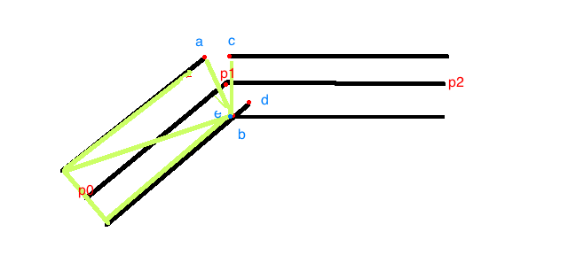

## 导入
> 在之前的项目当中，岔路使用的是黑色渐变，造成了渐变后的黑色仍然会覆盖掉其它图层的问题，本次主要来探讨解决此问题

# 透明渐变的方案更改

## 一、黑色渐变的问题
  最后渐变成黑色，会遮挡其它显示层级
## 二、透明渐变
### 1、原理
透明其实运用的是颜色的混合，取前后图层进行混合叠加
### 2、风险点
- 渲染贴图的重复部分会造成颜色加深
- 更改用拼三角形的方式会造成顶点数的成倍增加
- 不能用圆形贴图来渲染，可能造成道路拐弯处不够圆滑

### 3、需要解决的问题
- 支持颜色混合模式
- 更改不重叠的贴图方式

## 三、不重复的贴图方式
### 1、基本实现

- 计算a\b\c\d四个点
- 计算出与p1点最近的交点，计算出e点
- 以e点为基点，在a与c点之间插入等长的三角形

### 2、情况分类
- 直线：抽析掉
- 折线：
